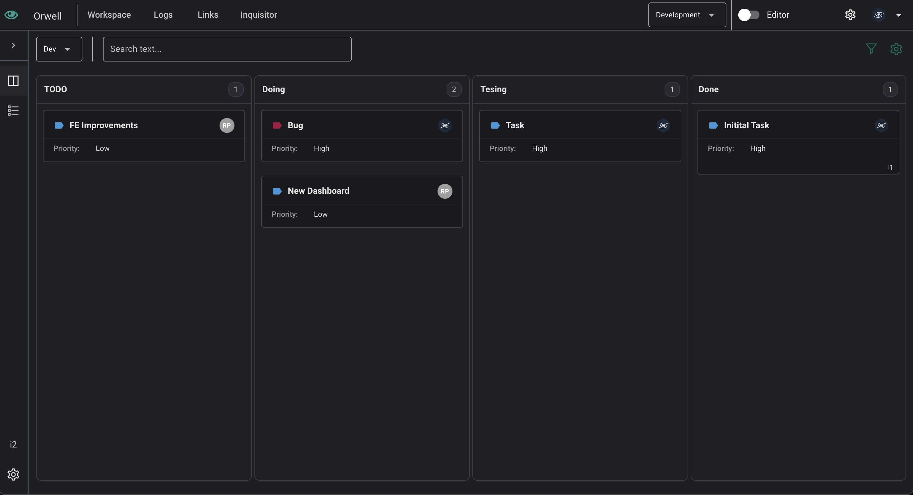
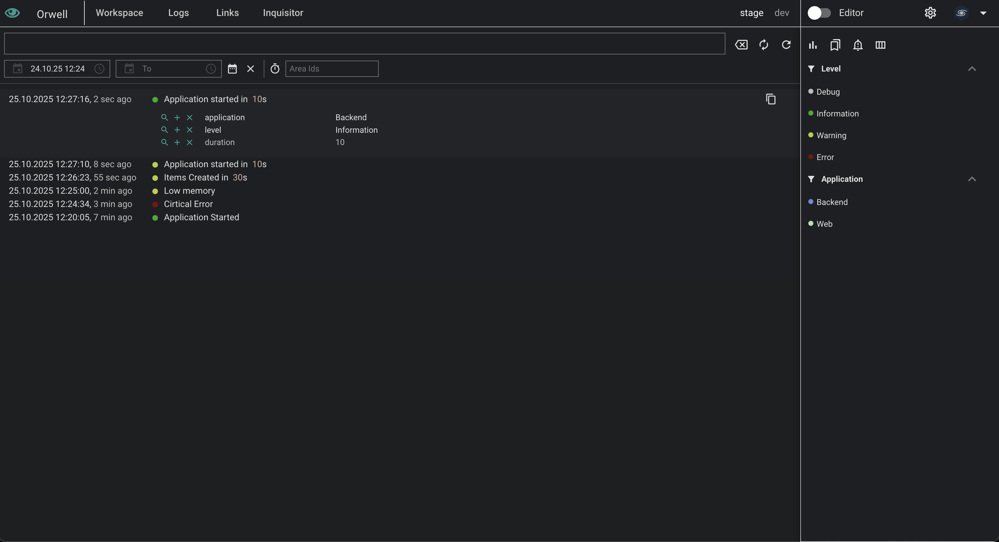
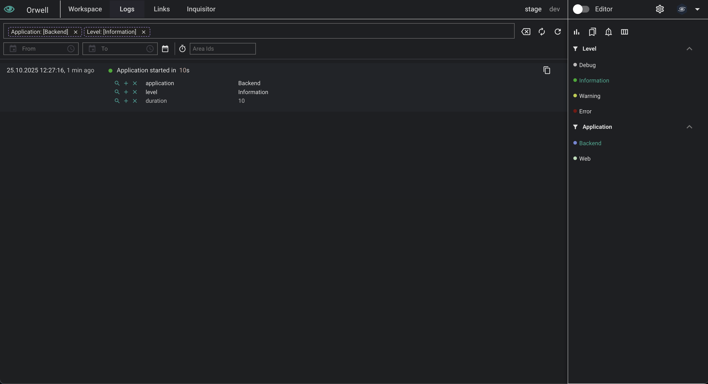
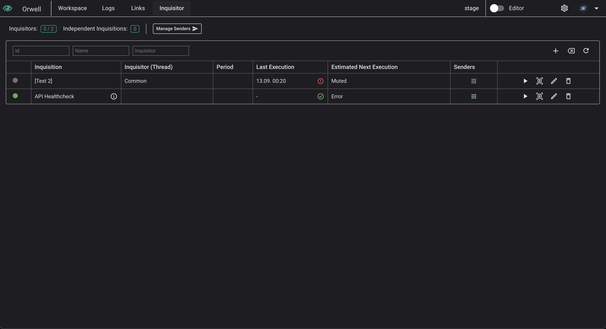
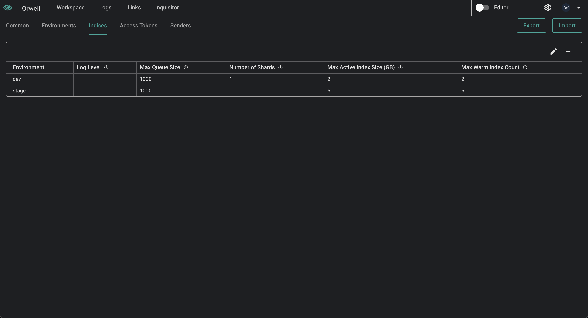

# Orwell

Application Intelligence Platform designed to centralize and manage logs, traces, and profiling data with an integrated search dashboard.
Orwell unifies incoming logs from various sources and includes a robust health check system for monitoring APIs, ensuring efficient status tracking and response validation - all in one comprehensive solution.

Homepage: https://github.com/MirilianGroup/orwell

## Features

### Logs, Metrics, Tracing, Profiling

Orwell centralizes all your observability data into a customizable dashboard with powerful filtering capabilities.
It integrates seamlessly with Kibana for advanced search and analysis.
You can create tailored widgets and visualizations to meet your specific monitoring needs.
The Profiling Dialog component helps you analyze performance data with detailed execution metrics and call hierarchies.
Create custom columns, templates, and filters to build the perfect dashboard to your monitoring needs.

#### Data Ingestion

You can send logs to Orwell through:

1. REST API Endpoints:

   - `POST /api/logs` - Send individual logs
   - `POST /api/logs/bulk` - Send multiple logs in batch
   - See `schemas/log-schema.json` for the required payload format

2. Message Brokers:
   - All messages must follow the schema defined in `schemas/log-schema.json`

### Inquisitor

Inquisitor is our application monitoring system that keeps an eye on your applications.

- Flexible API monitoring
- Customizable health check intervals
- Instant notifications via Slack or Microsoft Teams
- Custom validation rules

Set up monitoring rules once and receive timely alerts when your services require attention.

### Workspaces (Task Management)

Workspaces help you organize your team’s work efficiently. Within a workspace, you can create and manage tasks tailored to your workflow.
• Custom Task Types: Define your own task types to match your team’s processes.
• Flexible Fields: Add a variety of custom fields—text, dates, dropdowns, checkboxes, and more—to capture all the information your team needs.
• Collaborative Management: Assign tasks, track progress, and keep everyone aligned within a workspace.
• Streamlined Organization: Group, filter, and sort tasks to focus on what matters most.

Workspaces make it easy to structure your team’s work, track progress, and ensure that nothing falls through the cracks.

### Getting Started

1. [Subscribe to Orwell](https://buy.stripe.com/5kAdQXefE2MM2tO6oo)
2. Receive your Docker Hub access token via email
3. Clone this repository
4. Configure the following files:
   - `.env`
   - `appsettings.json`
   - `docker-compose.yml`
5. Authenticate with Docker Hub:
   ```bash
   docker login -u mirilianorwell -p <access_token>
   ```
6. Deploy Orwell:
   ```bash
   docker compose up -d
   ```
7. Access the Web UI at:
   ```bash
   http://localhost:8080     # For local deployment
   http://<host-ip>:8080    # For remote deployment
   ```

### Quick Setup Guide

1. Log in with your Admin Access Token (configured in `.env`)
2. Navigate to the settings menu (⚙️) to configure:
   - Environments
   - Log indices
   - Access tokens
3. Optional: Configure message brokers
4. Start sending logs using your configured access tokens
5. Explore the dashboard and customize your views by:
   - Creating filters
   - Setting up widgets
   - Configuring alerts

## Technologies and Tools

### Orwell Stack

- .NET
- Elasticsearch
- Kibana

### Message Brokers

- RabbitMQ
- Azure Service Bus
- Apache Kafka (coming soon)

## Support

Orwell web is self documented. It includes helpful tooltips and usage examples throughout the interface. For additional support or inquiries, contact our team at orwell@mirilian.com.

## Screenshots






